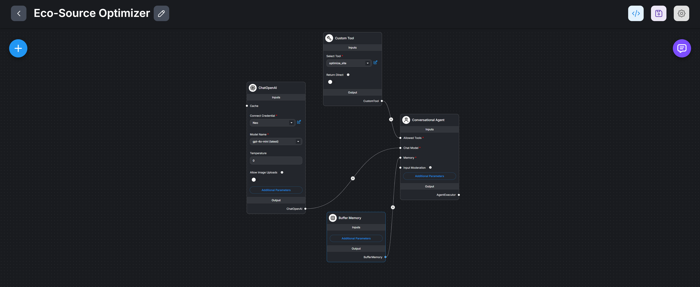

## 📋 Overview

This MVP implements the **"Eco-Source Optimizer"** agent, which acts as a virtual site manager. It analyzes real-time telemetry (battery levels, grid prices, site load) to intelligently switch between Grid, Battery, and Generator power sources.

Unlike standard chatbots, this system uses a deterministic **LangGraph** backend to enforce business logic and safety rules, ensuring that AI decisions are physically safe and economically optimal.

## Key Features

* ** Eco-Source Optimizer:** Automatically decides the cheapest power source based on real-time tariffs and battery health.
* ** "Immune System" Validation:** Uses **Pydantic** to strictly validate all incoming sensor data, preventing "hallucinated" values or sensor tampering (e.g., negative battery levels).
* ** Deterministic Logic:** Powered by **LangGraph**, ensuring predictable state transitions (e.g., "If battery < 30%, force Grid charge").
* ** Human-Accessible Interface:** Uses **FlowiseAI** as a low-code chat interface, allowing Facility Managers to query site status and run optimizations using natural language.
* ** Dockerized Deployment:** One-click local deployment using Docker Compose.

## Tech Stack

* **Frontend / UI:** [FlowiseAI](https://flowiseai.com/) (Low-code LLM Orchestrator)
* **Backend API:** FastAPI (Python)
* **Agent Logic:** LangGraph (Stateful Agent Architecture)
* **Data Validation:** Pydantic (Strict Data Schemas)
* **Infrastructure:** Docker & Docker Compose
* **Database:** PostgreSQL (for state persistence)

## Project Structure

```text
/
├── docker-compose.yml      # Orchestrates Flowise, Backend, and DB
├── README.md               # Project Documentation
└── backend/                # The Brain (Python Service)
     ├── server.py          # FastAPI endpoints exposed to Flowise
     ├── agent.py           # LangGraph logic for the Optimizer
     ├── pydantic_schemas.py# Data contracts and validation rules
     ├── requirements.txt   # Python dependencies
     └── Dockerfile         # Backend container definition
```

## Getting Started

Prerequisites

* Docker Desktop (Running)
* Git
* An API Key for an LLM provider (OpenAI, Anthropic, or Google Gemini)

## Installation

1. Clone the repository

   ```bash
   git clone [https://github.com/your-username/axin-energy-ai.git](https://github.com/your-username/axin-energy-ai.git)
   cd axin-energy-ai
   ```

2. Start the Platform Run the following command in the root directory:

   ```bash
   docker-compose up --build -d
   ```

3. Verify Status
   * Backend API: Active at ```http://localhost:8000/docs```
   * Flowise UI: Active at ```http://localhost:3000```
  
## Configuration (Flowise Setup)

Since Flowise is a visual tool, you need to configure the "Brain" once after installation.

1. Open Flowise at ```http://localhost:3000```
2. Add your LLM Credential (e.g., OpenAI API Key)
3. Create a new Chatflow with the following nodes:
   * Chat Model: ChatOpenAI (Temp: 0)
   * Agent: Conversational Agent (or Tool Agent)
   * Memory: Buffer Memory (Connect to Agent)
   * Tool: Custom Tool (Connect to Agent)

4. Custom Tool Configuration:
   * Name: optimize_site
   * Schema & Code: Copy strictly from the ```Chatflow.json``` file included
   * Important: Ensure the URL in the tool code is ```http://backend:8000/optimize```
  

